# Deployment Process
The steps for deploying this project are described below.

## Prerequisites
### AWS Setup
- Create/acquire an [**AWS account**](https://aws.amazon.com/resources/create-account/) with privileges to create and delete the following resources:
	- EC2 instances
	- Security Group with inbound and outbound rules
	- IAM User
	- AWS Access Key
- [Install **AWS CLI v2**](https://docs.aws.amazon.com/cli/latest/userguide/getting-started-install.html).
- Configure AWS CLI to connect to you AWS account:
	- Run the command `aws configure`.
	- Enter the _access key ID_ that was generated previously.
	- Enter the _access key Secret_.
	- Enter your preferred [_AWS Region's code_](https://docs.aws.amazon.com/general/latest/gr/rande.html#regional-endpoints) for this project.
	- Enter your preferred [_output format_](https://docs.aws.amazon.com/cli/latest/userguide/cli-usage-output-format.html).
- [Generate an **Access Key**](https://docs.aws.amazon.com/IAM/latest/UserGuide/access-key-self-managed.html#Using_CreateAccessKey) for your AWS account that has the privileges mentioned above. Avoid using Root User, create an IAM User if needed.

### Git and GitHub Setup
- Create a [**GitHub account**](https://docs.github.com/en/get-started/start-your-journey/creating-an-account-on-github) and [**fork this repository**](https://docs.github.com/en/pull-requests/collaborating-with-pull-requests/working-with-forks/fork-a-repo).
- [Install **Git**](https://git-scm.com/install/) and clone the **repository fork in your account** to your preferred working directory.
	```sh
	# Choose one below
	git clone https://github.com/<your-github-id>/<repository-fork-name>.git # using HTTPS
	git clone git@github.com:<your-github-id>/<repository-fork-name>.git # using SSH
	```
- [_Optional_] **Initialise Git** and add **add your repository fork as remote repository**.
	```sh
	cd /path/to/repo/clone # go in the cloned directory
	git init # initialise git
	git config user.name "Your Name" # configure your name
	git config user.email <your-email-address> # configure your email address
	git remote add <remote-repo-name> <remote-repo-url> # adding remote repo using SSH or HTTP link
	```
### Other requirements
- Create/acquire a [**Docker Hub**](http://hub.docker.com/) account.
- [Install **Terraform**](https://developer.hashicorp.com/terraform/install).
- [_Optional_] Create/acquire an **email address** with the feature of _password-authentication over SMTP_, to be used by Jenkins to send email notifications.

## Step 1: Configure and run Terraform code
- Open the file **`Terraform/terraform.tfvars`** and modify the values of the defined variables as per your reuqirement. Leave _default values_ for variables that _you don't require_.

> [!IMPORTANT]  
> **Your ISP might be _blocking port 22_ traffic on your networks.**  
> As such, it's recommended to keep `SSH_Alt = 443` in the `external_access_ports` variable, as it's the HTTPS port that's never blocked.  

- Open the **`Terraform`** directory in your **terminal** and run the following commands and wait for execution completion:
	- Initialise Terraform:
		```sh
		terraform init
		```
	- Validate code syntax:
		```sh
		terraform validate
		```
	- Show change plans:
		```sh
		terraform plan
		```
	- Apply planned changes:
		```sh
		terraform apply -auto-approve
		```
		> ✒️ **Note:** Remove the `-auto-approve` flag if you wish to manually approve each change.  

## Step 2: Connect to Control Node and prepare it
- Open the [**AWS Console EC2 Instances page**](https://console.aws.amazon.com/ec2/home?#Instances:) and sign in to your AWS account.
- Ensure that you're in the **correct AWS Region** from the _top-right corner_ of the web-page.
- Copy the public IP address of the **Control Node** instance. It should be in _Running_ state and have the name in the format "`<Project_Prefix>-<InstanceName>`".
	
	

- Copy the following items to the specified directories of the **Control Node** using **Secure Copy (`scp`)**:
	> ℹ️ **Info:** The generated SSH keys are named in the format "`<Project_Prefix>-<Ansible_SSH_Key_Name>`". If you haven't changed the default values in `terraform.tfvars`, the commands below require no modification to key names.  

	- **`Ansible/` directory** with its contents to _home directory_.
		```sh
		scp -i Terraform/.secrets/BoardGame_Backend-EC2_SSH_key.pem -P 443 -r Ansible/ ubuntu@<ControlNode-Public-IP>:~/
		```
	- **`Kubernetes/` directory** with its contents to the _home directory_.
		```sh
		scp -i Terraform/.secrets/BoardGame_Backend-EC2_SSH_key.pem -P 443 -r Kubernetes/ ubuntu@<ControlNode-Public-IP>:~/
		```
	- **`Terraform/.secrets/BoardGame_Backend-Ansible_SSH_key.pem`** to _`~/.ssh/`_ directory.
		```sh
		scp -i Terraform/.secrets/BoardGame_Backend-EC2_SSH_key.pem -P 443 Terraform/.secret/BoardGame_Backend-Ansible_SSH_key.pem ubuntu@<ControlNode-Public-IP>:~/.ssh/
		```
- Connect to the **Control Node** EC2 instance using **SSH**.
	```sh
	ssh -i Terraform/.secrets/BoardGame_Backend-Ansible_SSH_key.pem -p 443 ubuntu@<ControlNode-Public-IP>
	```
- Prepare the instance for running Ansible playbooks.
	- Update the repositories.
		```sh
		sudo apt update -y
		```
	- Upgrade the system.
		```sh
		sudo apt upgrade -y
		```
	- Install Ansible.
		```sh
		sudo apt install -y ansible
		```
## Step 3: Configure and run Ansible in Control Node
- Ensure that the **`Ansible/` directory** contains the **6 playbooks** and the **inventory INI** files. If they're not present, use `scp` to copy them from your system.
	
	

- Add **remote hosts** to **list of known hosts**. This may not be required, but the next step might fail without it.
	```sh
	ssh-keyscan -H {<remote-host-ip-address_separated-by-comma>} >> ~/.ssh/known_hosts
	```
	Here, "remote hosts" are the _other EC2 instances created_. Their public IP addresses should be in the file "**`Ansible/inventory.ini`**".  
	Type "`yes`" when it's waiting for your input.
- Test Ansible connection to the **managed nodes**.
	```sh
	ansible all -i ~/Ansible/inventory.ini -m ping
	```
	If the step above was skipped, you will need to enter "`yes`" when it's waiting for your input.
	
	[Enter "yes" when prompted by Ansible ping](/Documentation/Attachments/Ansible_SSH_Yes.png "Enter \"yes\" when prompted by Ansible ping")

	<p style="text-align: center;">
	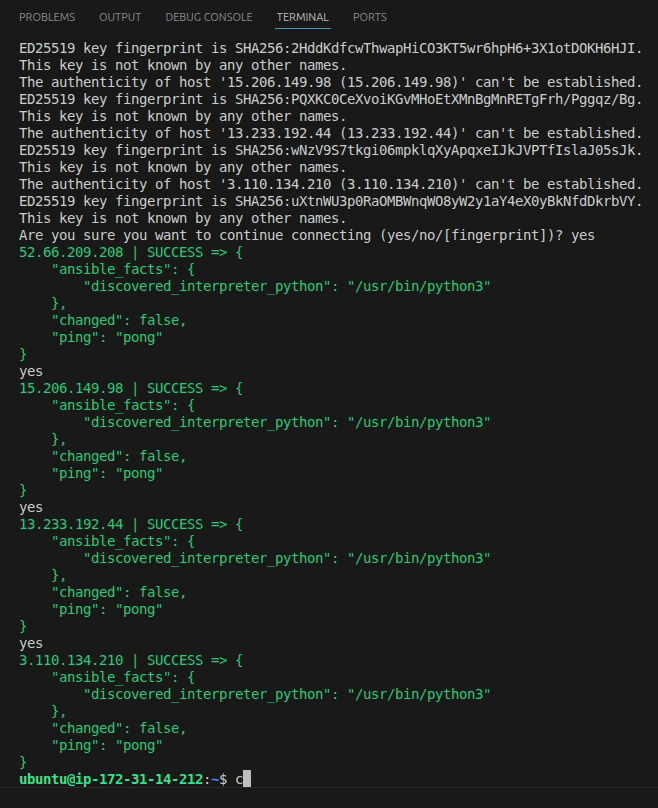
	</p>

- Run the playbooks
	```sh
	ansible-playbook -i ~/Ansible/inventory.ini ~/Ansible/<playbook-file-name>
	```
	- Run `01_InstallDocker.yaml` to **install Docker** in the EC2 instances.
	- Run `02_RunDockerContainers.yaml` to **run the required Docker containers** in their respective EC2 instances.
	- Run `03_ConfigureJenkinsContainer.yaml` to **install necessary tools and plugins** inside the Jenkins container running in the _Jenkins EC2 instance_.
	- Run `04_InstallClusterTools.yaml` to install **AWS CLI v2**, **`eksctl`** and **`kubectl`** in the _Control Node_.
	- Run `05_RetrieveInitialPasswords.yaml` to get the **intial admin passwords** for **Jenkins and Nexus** portals. Store them in safely and securely for initial configuration.
	- Don't run `06_RunMonitoringContainers.yaml` yet.
	
	The playbook `06_RunMonitoringContainers.yaml` runs **Blackbox Exporter**, **Grafana** and **Prometheus** containers in the _Monitoring EC2 instance_ for monitoring the application **after deployment**.

> [!NOTE]  
> - All the playbooks are **named/numbered in the sequence** they should be run in.  
> - The playbook "`06_RunMonitoringContainers.yaml`" requires the **external IP address** for accessing the application, so it's ran after application deployment.  

## Step 4: Prepare Nexus Repository
- Open the **Nexus Repository web interface** by going to `http://<Nexus-EC2-instance-public-IP-address>:8081`.
- Enter the **initial Nexus Repository admin password** retrieved by `05_RetrieveInitialPasswords.yaml` Ansible playbook, in the _Login_ page.
- Create the **new admin password** when prompted, then continue to the next setup pages.
- Select _Disable anonymous access_ option in the **Configure Anonymous Access** page.

[Nexus Repository Dashboard](/Documentation/Attachments/Nexus_Repository_Dashboard.png "Nexus Repository Dashboard")

<p style="text-align: center;">
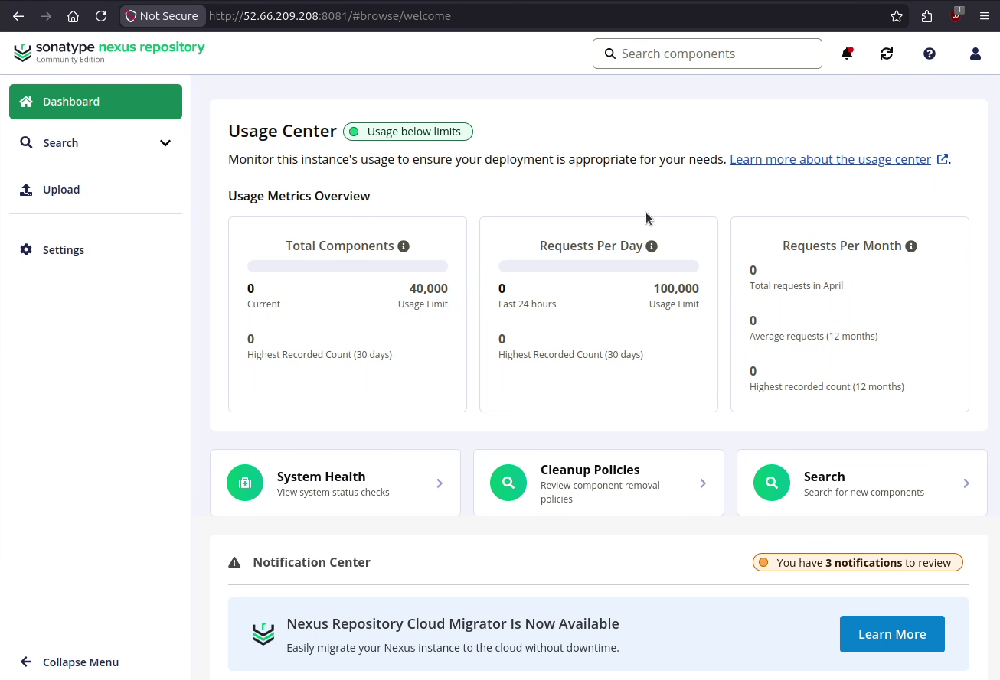
</p>

## Step 5: Prepare SonarQube and generate token
### Step 5.1: Initial configuration
- Open the **SonarQube web interface** by going to `http://<SonarQube-EC2-instance-public-IP-address>:9000`.
- Enter "**`admin`**" in **both _Username_ and _Password_** fields to login with the initial admin credentials.
- Create the **new admin password** in the **Update your password** page. Ensure to follow the password rules shown on screen.
- The SonarQube home page should now be visible.

[SonarQube Home Page](/Documentation/Attachments/SonarQube_HomePage.png "SonarQube Home Page")

<p style="text-align: center;">
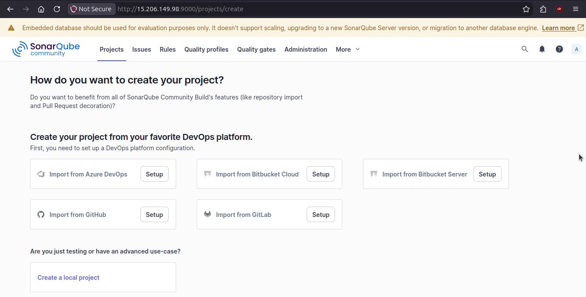
</p>

### Step 5.2: Generate token
- [**Generate a token**](https://docs.sonarsource.com/sonarqube-server/user-guide/managing-tokens#generating-a-token) of type _Global Analysis Token_, with your preference for name and expiration.
- **Copy and save the token _IMMEDIATELY_**. This token will _**NOT be available later**_.

[SonarQube Token Generation](/Documentation/Attachments/SonarQube_TokenGeneration.png "SonarQube Token Generation")

<p style="text-align: center;">
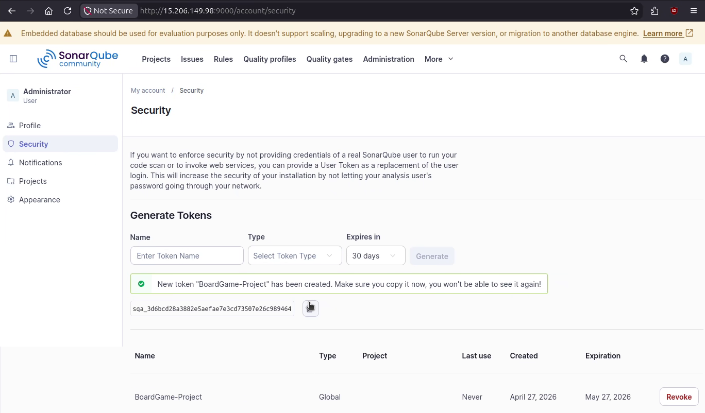
</p>

## Step 6: Prepare Jenkins for building
### Step 6.1: Initial configuration
- Open the **Jenkins web interface** by going to `http://<Jenkins-EC2-instance-public-IP-address>:8080`.
- Enter the **initial Jenkins admin password** retrieved by `05_RetrieveInitialPasswords.yaml` Ansible playbook, in the **Unlock Jenkins** page.
- Choose your preferred _plugins setup option_ in the **Customize Jenkins** page.
- Enter **new admin credentials** in the **Create First Admin User** page.
- Verify the URL in the Instance Configuration page and click on Save and Finish button.
- The next page should display messages saying that _Jenkins is ready to use_. Click the **Start using Jenkins** button to open the Jenkins home page.
	
	[Jenkins ready to use](/Documentation/Attachments/Jenkins_Ready.png "Jenkins ready to use")

	
	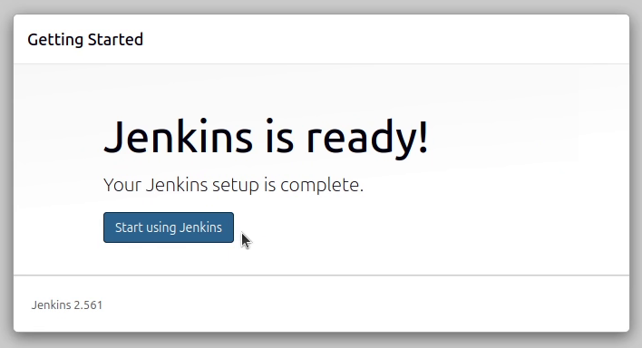
	

- Go to _**Manage Jenkins** > **Plugins**_ (under _**System Configuration** section_) and ensure that the following plugins are active:
	- [AWS Credentials](https://plugins.jenkins.io/aws-credentials) (`aws-credentials`)
	- [Config File Provider](https://plugins.jenkins.io/config-file-provider) (`config-file-provider`)
	- [Docker](https://plugins.jenkins.io/docker-plugin) (`docker-plugin`)
	- [Docker Pipeline](https://plugins.jenkins.io/docker-workflow) (`docker-workflow`)
	- [Eclipse Temurin Installer](https://plugins.jenkins.io/adoptopenjdk) (`adoptopenjdk`)
	- [Email Extension](https://plugins.jenkins.io/email-ext) (`email-ext`)
	- [HTML Publisher](https://plugins.jenkins.io/htmlpublisher) (`htmlpublisher`)
	- [Kubernetes](https://plugins.jenkins.io/kubernetes) (`kubernetes`)
	- [Kubernetes CLI](https://plugins.jenkins.io/kubernetes-cli) (`kubernetes-cli`)
	- [Maven Integration](https://plugins.jenkins.io/maven-plugin) (`maven-plugin`)
	- [Nexus Artifact Uploader](https://plugins.jenkins.io/nexus-artifact-uploader) (`nexus-artifact-uploader`)
	- [Pipeline Maven Integration](https://plugins.jenkins.io/pipeline-maven) (`pipeline-maven`)
	- [Pipeline: AWS Steps](https://plugins.jenkins.io/pipeline-aws) (`pipeline-aws`)
	- [SonarQube Scanner](https://plugins.jenkins.io/sonar) (`sonar`)
	
	[Jenkins Installed Plugins](/Documentation/Attachments/Jenkins_Installed_Plugins.png "Jenkins Installed Plugins")

	<p style="text-align: center;">
	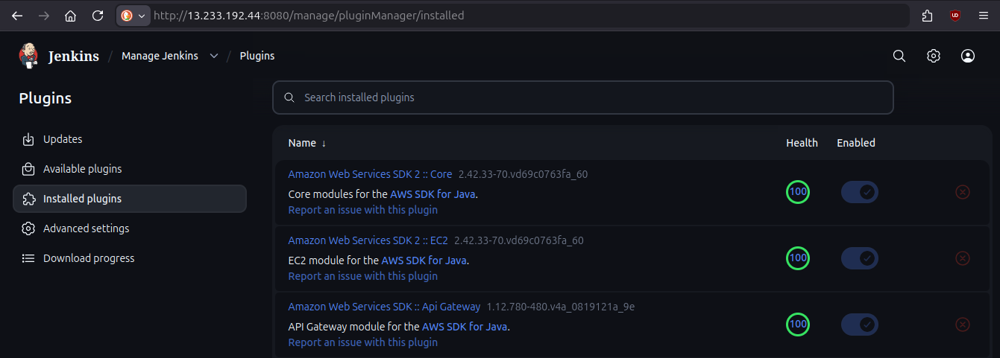
	</p>

> [!NOTE]  
> All required Jenkins plugins should be installed automatically by the Ansible playbook "`03_ConfigureJenkinsContainer.yaml`".  
> However, there might be issues where plugins get installed but not enabled.  

### Step 6.2: Add credentials
[Jenkins Adding Credentials](/Documentation/Attachments/Jenkins_Add_Credentials.png "Jenkins Adding Credentials")

<p style="text-align: center;">
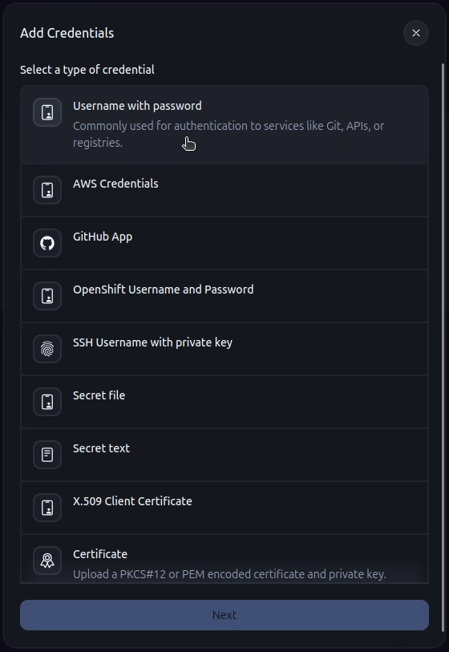
</p>

- Add Global credentials in Jenkins for the following as the specified types:
	| Credentials                | Jenkins Credential Type                                                                     | Description                                                                                                     |
	|----------------------------|---------------------------------------------------------------------------------------------|-----------------------------------------------------------------------------------------------------------------|
	| **AWS Access Key**         | AWS Credentials (via [AWS Credentials plugin](https://plugins.jenkins.io/aws-credentials/)) | Access Key generated using Terraform for EKS admin IAM User, stored in `Terraform/.secrets/AWS_Access_Key.csv`. |
	| **Docker Hub credentials** | Username with password                                                                      | Username and password of your Docker Hub account.                                                               |
	| **SonarQube Token**        | Secret text                                                                                 | SonarQube token generated in [previous section](#step-52-generate-token).                                          |
- Note down the **credential IDs** you used for Jenkins to uniquely identify each credential.

### Step 6.3: Create Maven configuration file
- Go to _**Manage Jenkins** > **Managed files**_ (under _**System Configuration** section_). This option appears if [Config File Provider](https://plugins.jenkins.io/config-file-provider/) plugin is _installed and active_.
- [**Add a new config file**](https://plugins.jenkins.io/config-file-provider/#plugin-content-load-your-configuration-file-content) of type _Global Maven settings.xml_, with a **config file ID** of your preference. Note down the config file ID.
- Modify the XML file using the _Content_ field and add the code below **within the `<servers></servers>` ("servers", plural) tag**.
	```xml
	      <server>
	        <id>maven-releases</id> <!-- Repository ID -->
	        <username><!-- NEXUS_REPO_ADMIN_USERNAME --></username>
	        <password><!-- NEXUS_REPO_ADMIN_PASSWORD --></password>
	      </server>
	      <server>
	        <id>maven-snapshots</id> <!-- Repository ID -->
	        <username><!-- NEXUS_REPO_ADMIN_USERNAME --></username>
	        <password><!-- NEXUS_REPO_ADMIN_PASSWORD --></password>
	      </server>
	```
	Replace **`<!-- NEXUS_REPO_ADMIN_USERNAME -->`** and **`<!-- NEXUS_REPO_ADMIN_PASSWORD -->`** with the _Nexus Repository admin **username** and **password**_ respectively, as set in [step 4](#step-4-prepare-nexus-repository).

[Editor of Config File Provider](/Documentation/Attachments/Jenkins_ConfigFile_Editor.png "Editor of Config File Provider")

<p style="text-align: center;">
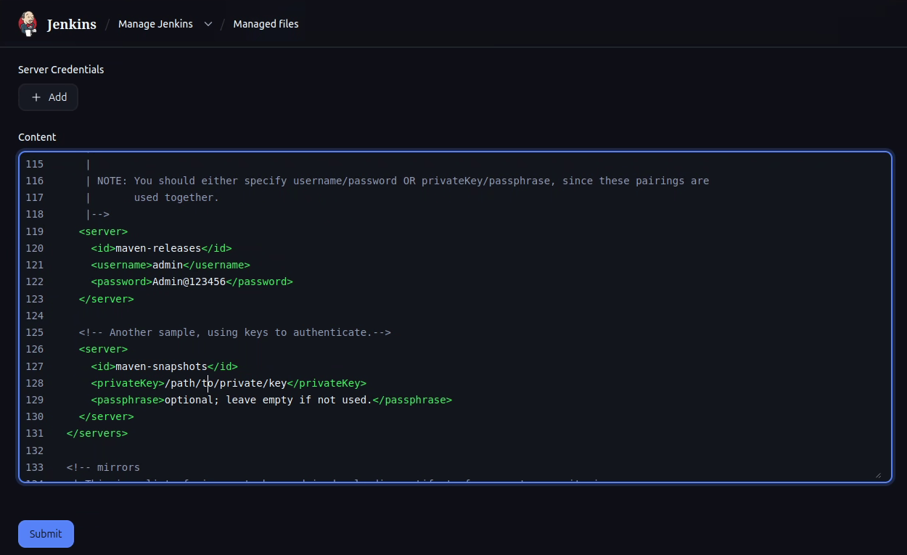
</p>

### Step 6.4: Configure Tools for Jenkins
Go to _**Manage Jenkins** > **Tools**_ (under _**System Configuration** section_) and install the requried tools as described below.

#### Step 6.4.1: Add Java Development Kit
- Scroll down to the _**JDK installataions** section_.
- Click on _**Add JDK** button_.
- Enter a name in the _**Name** field_ as per your preference and note it down.
- Leave the **JAVA_HOME** field _blank_ and check the _**Install automatically** checkbox_.
- Click on the _**Add Installer** button_ and select the option "**Install from adoptium.net**" (requires [Eclipse Temurin Installer](https://plugins.jenkins.io/adoptopenjdk) plugin).
- Select Java version _17 or newer_ from the _**Version** dropdown_.

#### Step 6.4.2: Add SonarQube Scanner
- Scroll down to the _**SonarQube Scanner installations** section_ (requires [SonarQube Scanner](https://plugins.jenkins.io/sonar) plugin).
- Click on _**Add SonarQube Scanner** button_.
- Enter a name in the _**Name** field_ as per your preference and note it down.
- Ensure that the _**Install automatically** checkbox_ is checked.
- Select the **latest version of SonarQube** from the _Version_ dropdown under the _Install from Maven Central_ section.

#### Step 6.4.3: Add Maven
- Scroll down to the _**Maven installations** section_ (requires [Maven Integration](https://plugins.jenkins.io/maven-plugin) and [Pipeline Maven Integration](https://plugins.jenkins.io/pipeline-maven) plugins).
- Click on the _**Add Maven** button_.
- Enter a name in the _**Name** field_ as per your preference and note it down.
- Ensure that the _**Install automatically** checkbox_ is checked.
- Select the **latest version of Maven** from the _Version_ dropdown under the _Install from Apache_ section.

After configuring all the tools, scroll to the bottom of the page and click on _**Apply** button_ and then click on the _**Save** button_.

### Step 6.5: Configure Jenkins system settings
Go to _**Manage Jenkins** > **System**_ (under _**System Configuration** section_) and install the requried tools as described below.

#### Step 6.5.1: Configure SonarQube settings
- Scroll down to the _**SonarQube servers** section_ (requires requires [SonarQube Scanner](https://plugins.jenkins.io/sonar) plugin).
- Enable the _**Environment variables** checkbox_ and click on the _**Add SonarQube** button_.
- Enter a name in the _**Name** field_ as per your preference and note it down.
- Enter the **SonarQube web-interface URL** in the _**Server URL** field_ as per the _specified format_ in that section.
- Select the **SonarQube credentials** created in [step 6.2](#step-62-add-credentials) from the _**Server authenticaion** token dropdown_.

> [!NOTE]  
> The _Server authentication token_ dropdown might show the text entered in the _**Description** field_ of the Jenkins Credentials interface in step 6.2.  

#### [_Optional_] Step 6.5.2: Configure email notification
- Generate an "**App Password**" in your preferred email service provider for password-authentication over SMTP. Your provider may have a different name for the feature.
- Scroll down to the _**E-mail Notification** section_.
- Enter your provider's **SMTP server address** in the _**SMTP server** field_.
- Click on the _**Advanced** button_ to open advanced configurations.
- Enable the _**Use SMTP Authentication** checkbox_.
- Enter the _full email address_ and _password_ in the _**User Name**_ and _**Password**_ fields respectively.
- Enable _**Use SSL**_ and/or _**Use TLS**_ checkboxes as required by your provider.
- Specify the _port_ in the _**SMTP Port** field_ as per your requirement, otherwise it will _default to port 465_.
- Enter values as per your preference in the fields not mentioned above.
- Click on the _**Apply**_ and _**Save**_ buttons at the bottom of the page.

[Jenkins Email Notification](/Documentation/Attachments/Jenkins_Email_Notification.png)

<p style="text-align: center;">
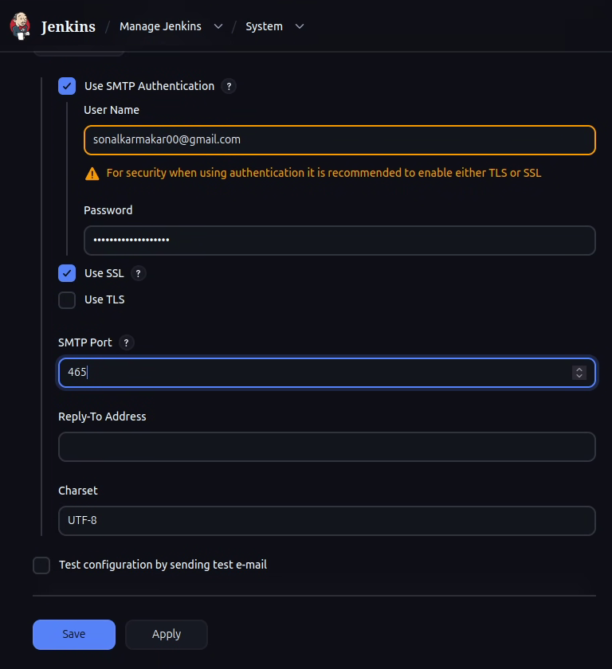
</p>

##### [_Optional_] Step 6.5.2a: Testing email notification
- Enable the checkbox labeled "**Test configuration by sending test e-mail**".
- Enter the _recipient email address_ in the _**Test e-mail recipient** field_.
- Click on the _**Test configuration** button_.

If configured properly, it will display the message "_Email was successfully sent_".
<p style="text-align: center;">


</p>

## Step 7: Prepare Jenkins build job
Prepare a Jenkins job for building and deploying the application by following the instructions below.

### Step 7.1: Create Jenkins pipeline job
[Jenkins Create New Job](/Documentation/Attachments/Jenkins_New_Job.png)
<p style="text-align: center;">
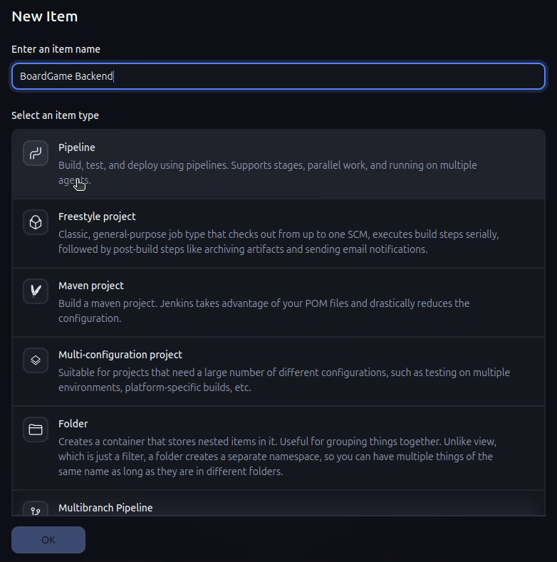
</p>

- Open Jenkins dashboard/home page.
- Click on the _**Create a job** button_ in the centre, or the _**New Item** button_ in the _side-pane_ on the right.
- In the _**New Item** page_, enter a _name for the job_, then select _**Pipeline**_ under "_Select an item type_".
- Click on the _**OK** button_ at the bottom.

### Step 7.2: Configure pipeline job
[Jenkins Configure Pipeline](/Documentation/Attachments/Jenkins_Configure_Pipeline.png)
<p style="text-align: center;">
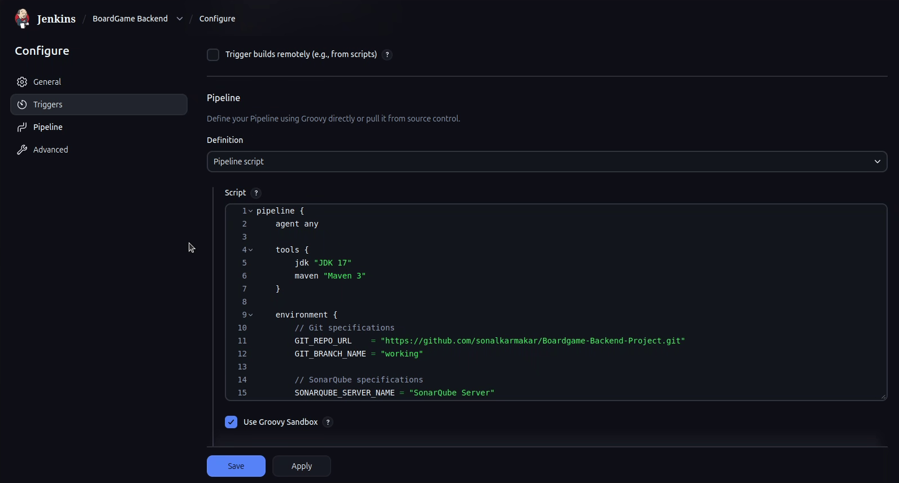
</p>

- Open Jenkins dashboard/home page and click on your job from the list.
- In the _**Configure** page_ of the job, enter an appropriate description in the _**Description** field_ of the _**General** section_.
- Scroll down to the _**Triggers** section_ and _check the box_ for the option "**GitHub hook trigger for GITScm polling**".
- [Create a **GitHub webhook**](https://docs.github.com/en/webhooks/using-webhooks/creating-webhooks#creating-a-repository-webhook) with the values for the fields specified below.
	- **Payload URL**: `http://<jenkins-host-address>:8080/github-webhook/` ('`/`' is _needed_ at the end)
	- **Content type**: `application/json`
	- **Which events would you like to trigger this webhook?**: `Send me everything`
	
	Unmentioned fields can be ignored or configured by preference.
- Click on _**Apply** button_ at the bottom.

### Step 7.3: Add the pipeline script
[Jenkins Pipeline Script](/Documentation/Attachments/Jenkins_Pipeline_Script.png)
<p style="text-align: center;">
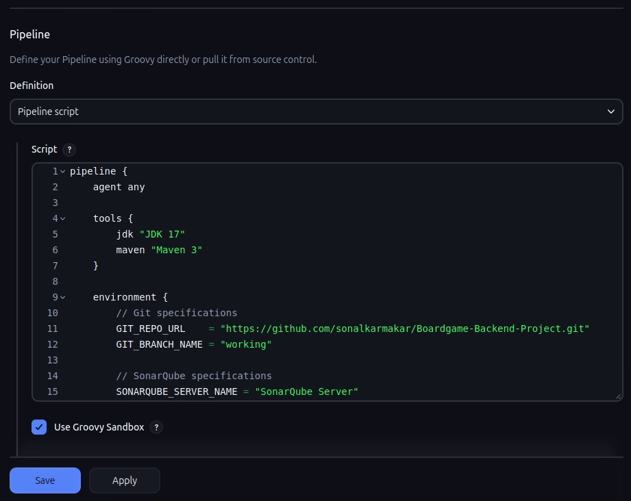
</p>

- Scroll down to the _**Pipeline** section_ of the job's _**Configure** page_.
- Select the option "**Pipeline script**" from the _**Definition** dropdown_.
- Copy the code from the file `Jenkins/Jenkinsfile` and paste inside the editor under "**Script**".
- Modify the variables in the pipeline script as specified below:
	- In the "_**`tools`**_" block, put the names of **JDK** and **Maven** tools _inside double-quotes_, as configured in previous steps [**6.4.1**](#step-641-add-java-development-kit) and [**6.4.3**](#step-643-add-maven) respectively.
		```groovy
		tools {
			jdk "JDK Tool Name"     // change as per your setup
			maven "Maven Tool Name" // change as per your setup
		}
		```
	- Provide the **appropriate correct values** for these critical vaiables in the "_**environment**_" block
		<table>
			<tr>
				<th>Topic</th>
				<th>Variable Name</th>
				<th>Description and Value</th>
			</tr>
			<tr>
				<td rowspan="2">Git</td>
				<td><code>GIT_REPO_URL</code></td>
				<td>Remote git repository URL. It's this project's GitHub repository URL here.</td>
			</tr>
			<tr>
				<td><code>GIT_BRANCH_NAME</code></td>
				<td>Remote git repository branch name. Specify which branch you wish to use.</td>
			</tr>
			<tr>
				<td rowspan="1">Trivy</td>
				<td><code>TRIVY_TEMPLATE_URL</code></td>
				<td>Template HTML for Trivy reports from <a href="https://github.com/aquasecurity/trivy/tree/main">Trivy's GitHub repository</a> (<code>/contrib/html.tpl</code> file). <b>Avoid changing, refer repo if necessary.</b></td>
			</tr>
			<tr>
				<td rowspan="1">SonarQube</td>
				<td><code>SONARQUBE_SERVER_NAME</code></td>
				<td>Name used for SonarQube server in <a href="#step-651-configure-sonarqube-settings">step 6.5.1</a>.</td>
			</tr>
			<tr>
				<td rowspan="1">Maven</td>
				<td><code>MAVEN_GLOBAL_SETTINGS_CONFIG</code></td>
				<td>Name used for Global Maven Configuration File in <a href="#step-63-create-maven-configuration-file">step 6.3</a>.</td>
			</tr>
			<tr>
				<td rowspan="4">Docker</td>
				<td><code>DOCKER_NAMESPACE</code></td>
				<td>Your Docker Hub account namespace. Typically it's your <i>Docker Hub username</i>.</td>
			</tr>
			<tr>
				<td><code>DOCKER_CRED_ID</code></td>
				<td>Unique ID used in Jenkins for Docker Hub credentials in <a href="#step-62-add-credentials">step 6.2</a>.</td>
			</tr>
			<tr>
				<td><code>DOCKER_REPO_URL</code></td>
				<td>Docker Hub endpoint API URL. Using version 1 (https://index.docker.io/v1/) here. <b>Don't change if not necessary.</b></td>
			</tr>
			<tr>
				<td><code>DOCKERFILE_PATH</code></td>
				<td>Path to Dockerfile for building image. It's "<code>Docker/Dockerfile</code>" for this project.</td>
			</tr>
			<tr>
				<td rowspan="1">AWS Access Key</td>
				<td><code>AWS_CRED_ID</code></td>
				<td>Unique ID used in Jenkins for AWS Credentials in <a href="#step-62-add-credentials">step 6.2</a>.</td>
			</tr>
		</table>

	- Change values to _your preference_ or _leave default_ for these variables in the "_**environment**_" block
		<table>
			<tr>
				<th>Topic</th>
				<th>Variable Name</th>
				<th>Description and Value</th>
			</tr>
			<tr>
				<td rowspan="7">Trivy</td>
				<td><code>TRIVY_FILES_DIR</code></td>
				<td>Jenkins workspace directory for storing Trivy files.</td>
			</tr>
			<tr>
				<td><code>TRIVY_FS_REPORT_FILE</code></td>
				<td>File name of Trivy's file-system scan report.</td>
			</tr>
			<tr>
				<td><code>TRIVY_FS_REPORT_NAME</code></td>
				<td>Name of the Trivy's file-system scan report.</td>
			</tr>
			<tr>
				<td><code>TRIVY_BLD_REPORT_FILE</code></td>
				<td>File name of Trivy's build scan report.</td>
			</tr>
			<tr>
				<td><code>TRIVY_BLD_REPORT_NAME</code></td>
				<td>Name of the Trivy's build scan report.</td>
			</tr>
			<tr>
				<td><code>TRIVY_IMG_REPORT_FILE</code></td>
				<td>File name of Trivy's image scan report.</td>
			</tr>
			<tr>
				<td><code>TRIVY_IMG_REPORT_NAME</code></td>
				<td>Name of the Trivy's image scan report.</td>
			</tr>
			<tr>
				<td rowspan="3">Docker</td>
				<td><code>DOCKER_REPOSITORY</code></td>
				<td>Your Docker Hub repository name.</td>
			</tr>
			<tr>
				<td><code>DOCKER_IMAGE_TAG</code></td>
				<td>Tags for the Docker image.</td>
			</tr>
			<tr>
				<td><code>DOCKER_IMAGE_NAME</code></td>
				<td>Name of the Docker image.</td>
			</tr>
			<tr>
				<td rowspan="2">AWS</td>
				<td><code>AWS_REGION</code></td>
				<td>AWS Region where the project is deployed.</td>
			</tr>
			<tr>
				<td><code>EKS_CLUSTER_NAME</code></td>
				<td>Name of the Elastic Kubernetes Cluster where the application is deployed.</td>
			</tr>
			<tr>
				<td rowspan="14">Email Notifications</td>
				<td><code>PASS_MAIL_FROM</code></td>
				<td>Build success notification email sender.</td>
			</tr>
			<tr>
				<td><code>PASS_MAIL_TO</code></td>
				<td>Build success notification email recipient.</td>
			</tr>
			<tr>
				<td><code>PASS_MAIL_CC</code></td>
				<td>Build success notification email carbon copy.</td>
			</tr>
			<tr>
				<td><code>PASS_MAIL_BCC</code></td>
				<td>Build success notification email blind carbon copy.</td>
			</tr>
			<tr>
				<td><code>PASS_MAIL_REPLY</code></td>
				<td>Build success notification email reply recipient.</td>
			</tr>
			<tr>
				<td><code>PASS_MAIL_SUBJ</code></td>
				<td>Build success notification email subject.</td>
			</tr>
			<tr>
				<td><code>PASS_MAIL_BODY</code></td>
				<td>Build success notification email message body.</td>
			</tr>
			<tr>
				<td><code>FAIL_MAIL_FROM</code></td>
				<td>Build failure notification email sender.</td>
			</tr>
			<tr>
				<td><code>FAIL_MAIL_TO</code></td>
				<td>Build failure notification email recipient.</td>
			</tr>
			<tr>
				<td><code>FAIL_MAIL_CC</code></td>
				<td>Build failure notification email carbon copy.</td>
			</tr>
			<tr>
				<td><code>FAIL_MAIL_BCC</code></td>
				<td>Build failure notification email blind carbon copy.</td>
			</tr>
			<tr>
				<td><code>FAIL_MAIL_REPLY</code></td>
				<td>Build failure notification email reply recipient.</td>
			</tr>
			<tr>
				<td><code>FAIL_MAIL_SUBJ</code></td>
				<td>Build failure notification email subject.</td>
			</tr>
			<tr>
				<td><code>FAIL_MAIL_BODY</code></td>
				<td>Build failure notification email message body.</td>
			</tr>
		</table>

> [!IMPORTANT]  
> Passing **blank variables (`VAR_NAME = ""`)** to email notification syntax will cause Jenkins to show **build failure** despite successful execution of all stages.  
> It's better to **remove unnecessary fields** from the email notification syntax in the "_`post`_" section of the pipeline script.

## Step 8: Create EKS Cluster
- Login to **Control Node EC2 instance**.
- Ensure that **AWS CLI v2**, **Eksctl** and **`kubectl`** are installed.
	<p style="text-align: center;">

	

	</p>
	```sh
	which aws eksctl kubectl # should output the executable path for each
	```
	If they aren't installed, run the Ansible playbook **`04_InstallClusterTools.yaml`**:
	```sh
	ansible-playbook -i ~/Ansible/inventory.ini ~/Ansible/04_InstallClusterTools.yaml
	```
- **Configure AWS CLI** with the _EKS admin IAM User_ created using Terrform code.
	- Run the command `aws configure`.
	- Enter the _access key ID_ stored in `Terraform/.secrets/AWS_Access_Key.csv`.
	- Enter the _access key Secret_ stored in `Terraform/.secrets/AWS_Access_Key.csv`.
	- Enter your preferred [_AWS Region's code_](https://docs.aws.amazon.com/general/latest/gr/rande.html#regional-endpoints) for this project.
	- Enter your preferred [_output format_](https://docs.aws.amazon.com/cli/latest/userguide/cli-usage-output-format.html).
- Run the `eksctl` command below with the specified values to create the EKS cluster.
	```sh
	eksctl create cluster \
		--name <CLUSTER_NAME> \
		--region <CLUSTER_REGION> \
		--nodegroup-name <NODE_GRP_NAME> \
		--node-type <NODE_TYPE> \
		--nodes <NODES> \
		--nodes-min <NODES_MIN> \
		--nodes-max <NODES_MAX> \
		--managed
	```
	- `<CLUSTER_NAME>`: cluster name as mentioned in the Jenkins pipeline script for variable "**`EKS_CLUSTER_NAME`**".
	- `<CLUSTER_REGION>`: AWS Region as mentioned in the Jenkins pipeline script for variable "**`AWS_REGION`**".
	- `<NODE_GRP_NAME>`: name of the group of cluster nodes.
	- `<NODE_TYPE>`: instance type of cluster nodes (_t2.small or larger_).
	- `<NODES>`: target number of cluster nodes.
	- `<NODES_MIN>`: minimum number of cluster nodes during low traffic.
	- `<NODES_MAX>`: maximum number of cluster nodes during high traffic.
- Run the AWS CLI command below to add the EKS cluster to `kubectl` context. `<CLUSTER_REGION>` and `<CLUSTER_NAME>` must be the same as described above.
	```sh
	aws eks update-kubeconfig --region <CLUSTER_REGION> --name <CLUSTER_NAME>
	```

[EKS cluster created](/Documentation/Attachments/eksctl_Cluster_Created.png)
<p style="text-align: center;">
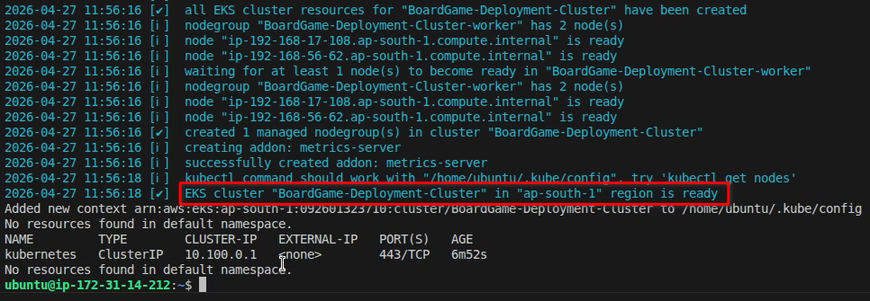
</p>

## Step 9: Build and Deploy the application
- Open the _Jenkins web interface_ and go to the build created in [**Step 7**](#step-7-prepare-jenkins-build-job).
- Commit the changes made to the **`pom.xml`** by the Terraform code. The Nexus Repository URL is added by the Terraform code when it's executed.
	
	Either make and commit the changes using [_GitHub website_](https://docs.github.com/en/repositories/working-with-files/managing-files/editing-files), or run the commands below if you've connected your repository fork to local working directory.
	```sh
	git add /path/to/pom.xml
	git commit -m "My commit message for pom.xml"
	```

- **Push the commit to your GitHub repository fork** to make the webhook trigger the Jenkins build process.
	```sh
	git push <remote-repo-name> <branch-name>
	```
- Monitor the build status from the Jenkins web interface.
- Login to the **Control Node EC2 instance** when the pipeline is successfully executed.
- Run the `kubectl` commands below to check the status of the _EKS cluster_.
	- Check Kubernetes service status.
		```sh
		kubectl get svc
		```
	- Check Kubernetes deployment status.
		```sh
		kubectl get deploy
		```
	- Check Kubernetes pods status.
		```sh
		kubectl get pods
		```
- Once the pods, deployment and service are up and running, note down the Kubernetes **service name** and **external IP address** from the output of `kubectl get svc`.
- Access the application website by going to the **Kubernetes external IP address**.

<p style="text-align: center;">
	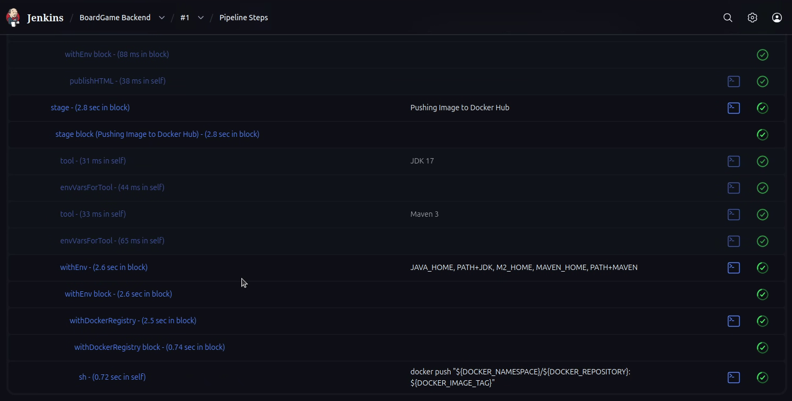
	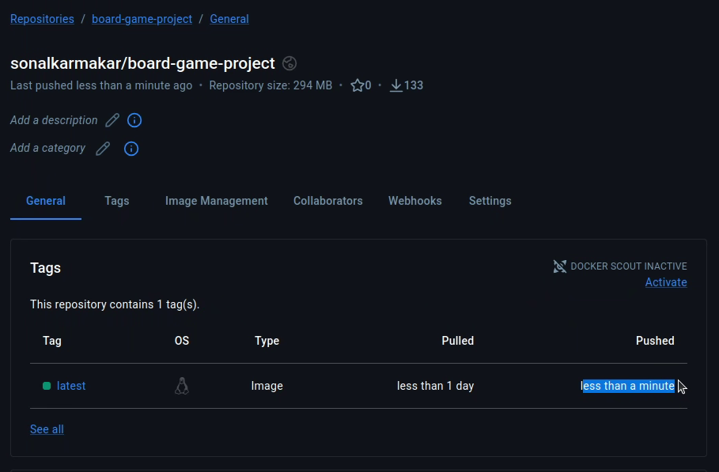
	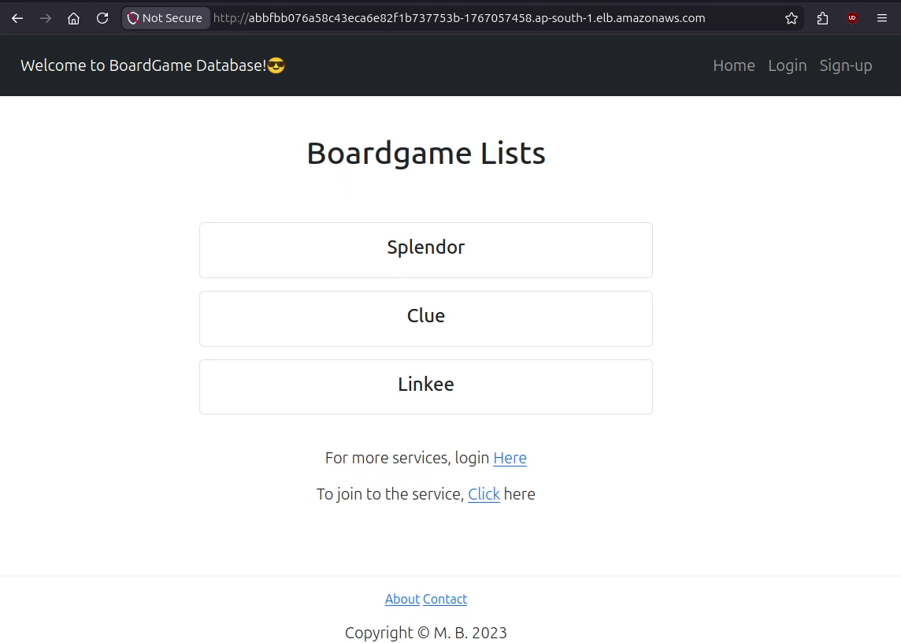
</p>

| Jenkins Build Status                                                        | Docker Hub                                                    | Deployed Application                                                         |
| :-------------------------------------------------------------------------: | :-----------------------------------------------------------: | :--------------------------------------------------------------------------: |
|  |  |  |

## Step 10: Monitor deployed application
- Login to the **Control Node EC2 instance**.
- Get the **Kubernetes service name** for the deployed application.
	```sh
	kubectl get svc
	```
- Run the Ansible playbook **`06_RunMonnitoringContainers.yaml`** and enter the _Kubernetes service name_ when prompted.
- Get the public IP address of the **Monitoring** EC2 instance from the [_AWS EC2 Instances page_](https://console.aws.amazon.com/ec2/home?#Instances:) in your **chosen AWS region**. It should be in _Running_ state and have the name in the format "`<Project_Prefix>-<InstanceName>`".
- Open the respective monitoring portals/web-interfaces:
	- Blackbox Exporter: `http://<monitoring-instance-public-ip>:9115`
	- Grafana: `http://<monitoring-instance-public-ip>:3000`
	- Prometheus: `http://<monitoring-instance-public-ip>:9090`

Now, Grafana needs to be configured to take the data and visualise in charts and graphs.

### Step 10.1: Configure Grafana for visualisation
Follow the instructions below to configure Grafana for visualising data collected using Prometheus and Blackbox Exporter.

#### Step 10.1.1: Initial configuration
- Open the **Grafana web-interface** at **`http://<monitoring-instance-public-ip>:3000`**.
- Login with the default credential "**`admin`**" for _both **username** and **password**_.
- Create your **new password** as prompted.

#### Step 10.1.2: Adding source for monitoring data
- In the **Grafana Home page**, click on the _**Connections** menu_ in the _left side-panel_.
- Click on **Data sources** under the _**Connections** menu_, then click on _**Add data source** button_ in the _**Data sources** page_.
- In the _**Add data source** page_, search for _Prometheus_ in the **search bar** and click on it. Usually, Prometheus is already visible under the _Time series databases_ category.
- In the **Prometheus data source page**,
	- Enter a **Name** of your choice.
	- Enter the **Prometheus server URL** (`http://<monitoring-instance-public-ip>:9090`) in the _**Connections** section_.
- Scroll down to the bottom of the page and click on the _**Save & test** button_. If it displays the message "_Successfully queried the Prometheus API_", then it's configured correctly.

[Grafana Data Source added](/Documentation/Attachments/Grafana_DataSource_Added.png)
<p style="text-align: center;">
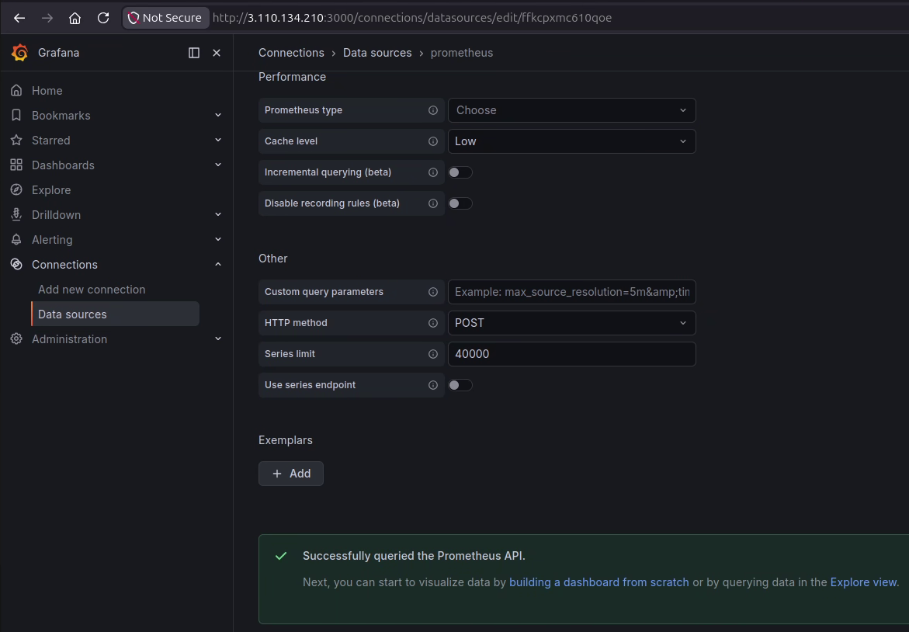
</p>

#### Step 10.1.3: Creating Dashboard
- Click on the _button with **plus icon (+)**_ beside the _search bar_ in the _top-right corner_ of the page, then click on **Import Dashboard**.
- Open the [**Grafana Dashboard catalogue**](https://grafana.com/grafana/dashboards/) in a new tab of your web browser and search for "_Prometheus Blackbox Exporter_" in the catalogue.

> [!NOTE]  
> The URL to Grafana Dashboard catalogue should be mentioned in the **Import Dashboard** page in a message about _finding and importing dashboards_.  

- Click on your preferred dashboard from the search results and copy the **dashboard ID**.
- Go back to the **Import Dashboard** page in your Grafana web-interface tab, and paste the ID in the field saying "_Grafana.com dashboard URL or ID_", then click on the _**Load** button_.  
	If the pasted ID is correct, the page will get a sub-heading "_Importing dashboard from Grafana.com_" and the settings/options in the page will change.
- From the dropdown menu labeled "_Select a Prometheus data source_", select the data source created in [**previous step**](#step-1012-adding-source-for-monitoring-data).
- Click on the _**Import** button_ at the bottom to see your monitoring dashboard.

[Grafana Dashboard](/Documentation/Attachments/Grafana_Dashboard.png)
<p style="text-align: center;">
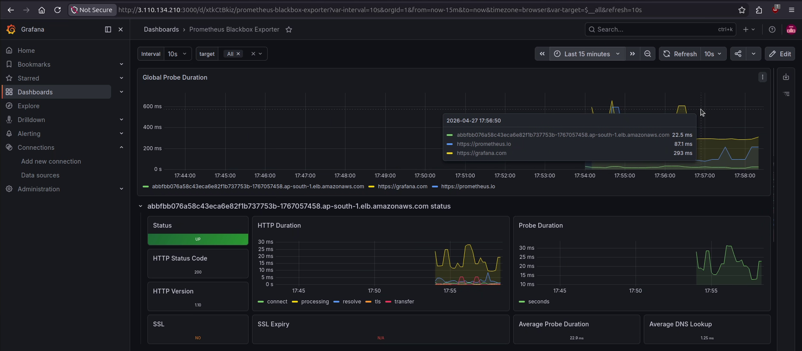
</p>

# Finally...
After following all the steps in each stage above,...
- The application is **deployed in AWS EKS cluster**, **accessible through the External IP** created by the _Kubernetes service_.
- Application can be **monitored from the Grafana Dashboard** using the _data collected by_ **Prometheus** and **Blackbox Exporter**.
- **Commits pushed** to application's _GitHub repository_ trigger **new Jenkins build** and **automatic deployment**, if there are no errors.
- **Application builds** are stored in the **Nexus Repository**.
- **Application's Docker image** is stored in your **Docker Hub account**.